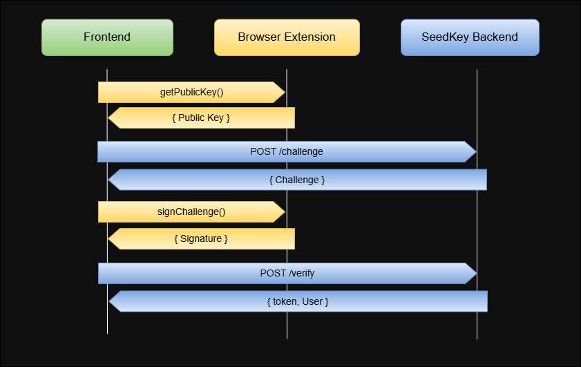

# 🔐 SeedKey Client SDK


SeedKey Client SDK — клиентская библиотека для беспарольной аутентификации через браузерное расширение, которая является частью Open Source экосистемы SeedKey.

## Содержание

- [🔍 Архитектура взаимодействия](#-архитектура-взаимодействия)
- [🧩Возможности](#-возможности)
- [📦 Установка](#-установка)
- [🚀 Быстрый старт](#-быстрый-старт)
- [🔧 Методы SDK](#-методы-sdk)
- [🔌 Интеграция с бэкендом](#-интеграция-с-бэкендом)
- [🤝 Контрибьютинг](#-контрибьютинг)
- [🛡️ Раскрытие уязвимостей](#-раскрытие-уязвимостей)
- [📄 Лицензия](#-лицензия)

## 🔍 Архитектура взаимодействия



## 🧩 Возможности

SDK предоставляет:

- **Коммуникацию с расширением** — получение `publicKey`, подпись `challenge` или кастомных сообщений.
- **High-level API** — готовый флоу аутентификации с вашим бэкендом по REST-контракту `auth()` / `register()` / `authenticate()`.
- **Low-level API** — гибкая кастомизация: `getPublicKey()` / `signChallenge()` / `requestChallenge()`.
- **Хелперы для хранения токенов** в `localStorage`.

Важно: ваш **бэкенд** должен реализовывать REST API (см. раздел [Интеграция с бэкендом](#-интеграция-с-бэкендом) ниже).

SDK также предоставляет инструменты для удобной интеграции аутентификации в ваш сервис:

- **Типы протокола** — интерфейсы для `Challenge`, `User`, `Token`, `Session`.
- **Криптографические утилиты** — верификация Ed25519-подписей.
- **Сервисы аутентификации** — `AuthService` и `KeyService`.
- **Абстракции хранилищ** — интерфейсы адаптеров для БД.
- **Типы ошибок** — `SeedKeyError` + `ERROR_CODES`.

## 📦 Установка

```bash
npm install @seedkey/sdk-client
```

```bash
yarn add @seedkey/sdk-client
```

```bash
pnpm add @seedkey/sdk-client
```

## 🚀 Быстрый старт

```ts
import { getSeedKey, saveTokens, SeedKeyError } from '@seedkey/sdk-client';

// Инициализация SDK
const sdk = getSeedKey({
  backendUrl: 'https://api.example.com',
  timeout: 60000,
  debug: true, 
});

// Проверка доступности расширения
const available = await sdk.isAvailable();
if (!available) {
  console.log('Установите расширение SeedKey');
  return;
}

// Проверка настройки расширения (если есть identity)
const initialized = await sdk.isInitialized();
if (!initialized) {
  console.log('Создайте Identity в расширении SeedKey');
  return;
}

// Аутентификация (автоматическая регистрация, если пользователь новый)
try {
  const result = await sdk.auth();
  console.log('User ID:', result.user.id);
  console.log('Access Token:', result.token.accessToken);

  // Сохранение токенов в localStorage
  saveTokens(result.token, result.user.id);
} catch (error) {
  if (error instanceof SeedKeyError) {
    console.error('Код:', error.code, 'Сообщение:', error.message);
  }
}
```

Работа с токенами:

```ts
import {
  saveTokens,
  getAccessToken,
  getRefreshToken,
  getUserId,
  isTokenExpired,
  hasToken,
  clearTokens,
  getSession,
  getSeedKey,
} from '@seedkey/sdk-client';

const sdk = getSeedKey();

// Получить access token
const token = getAccessToken();

// Проверить истечение токена
if (isTokenExpired()) {
  const newTokens = await sdk.refreshToken(getRefreshToken()!);
  saveTokens(newTokens, getUserId() ?? undefined);
}

// Получить всю сессию
const session = getSession();
// { accessToken, refreshToken, userId, isExpired }

// Очистить при выходе
clearTokens();
```

Обработка ошибок:

```ts
import { getSeedKey, SeedKeyError, ERROR_CODES } from '@seedkey/sdk-client';

const sdk = getSeedKey();

try {
  await sdk.auth();
} catch (error) {
  if (error instanceof SeedKeyError) {
    switch (error.code) {
      // Extension errors
      case ERROR_CODES.EXTENSION_NOT_FOUND:
        // Расширение не установлено
        break;
      case ERROR_CODES.NOT_INITIALIZED:
        // Identity не настроена
        break;
      case ERROR_CODES.EXTENSION_LOCKED:
        // Расширение заблокировано
        break;
      case ERROR_CODES.TIMEOUT:
        // Таймаут операции
        break;

      // User actions
      case ERROR_CODES.USER_REJECTED:
        // Пользователь отклонил запрос
        break;

      // Network errors
      case ERROR_CODES.NETWORK_ERROR:
        // Ошибка сети
        break;
      case ERROR_CODES.SERVER_ERROR:
        // Ошибка сервера
        break;

      // Auth errors
      case ERROR_CODES.USER_NOT_FOUND:
        // Пользователь не найден
        break;
      case ERROR_CODES.USER_EXISTS:
        // Пользователь уже существует
        break;
      case ERROR_CODES.INVALID_SIGNATURE:
        // Невалидная подпись
        break;
      case ERROR_CODES.INVALID_TOKEN:
        // Невалидный токен
        break;
    }

    console.log('Код:', error.code);
    console.log('Сообщение:', error.message);
    console.log('Подсказка:', error.hint);
  }
}
```

Вы можете положиться на SDK и механизм сам выполнит за вас всю рутину, или реализовать логику самостоятельно, используя низкоуровневое API библиотеки.

В базовом варианте флоу аутентификации выглядит так:

1. Extension: `sdk.getPublicKey()`
2. Backend: `POST /api/v1/seedkey/challenge` `{ publicKey, action: "authenticate" }`
3. Extension: `sdk.signChallenge()`
4. Backend: `POST /api/v1/seedkey/verify` `{ challengeId, challenge, signature, publicKey }`

Флоу регистрации:

1. Extension: `sdk.getPublicKey()`
2. Backend: `POST /api/v1/seedkey/challenge` `{ publicKey, action: "register" }`
3. Extension: `sdk.signChallenge()`
4. Backend: `POST /api/v1/seedkey/register` `{ publicKey, challenge, signature, metadata }`

## 🔧 Методы SDK

| Метод | Описание | Возвращает |
|:--|:--|:--|
| `isAvailable()` | Проверить, установлено ли расширение | `Promise<boolean>` |
| `isInitialized()` | Проверить, инициализировано ли расширение | `Promise<boolean>` |
| `getPublicKey()` | Получить публичный ключ для текущего домена | `Promise<string>` |
| `signMessage(message)` | Подписать сообщение (опционально) | `Promise<SignMessageResult>` |
| `signChallenge(challenge: Challenge)` | Подписать `Challenge` | `Promise<SignChallengeResult>` |
| `register(opts?)` | Регистрация нового аккаунта | `Promise<AuthResult>` |
| `authenticate()` | Аутентификация существующего аккаунта | `Promise<AuthResult>` |
| `auth(opts?)` | Умная аутентификация (регистрация/вход) | `Promise<AuthResult>` |
| `getUser(accessToken)` | Получить профиль текущего пользователя | `Promise<UserProfile>` |
| `logout(accessToken)` | Выход (инвалидация access token) | `Promise<void>` |
| `refreshToken(refreshToken)` | Обновить пару токенов | `Promise<TokenInfo>` |
| `getVersion()` | Получить версию SDK | `string` |
| `destroy()` | Очистить ресурсы | `void` |

Важно: ваш **бэкенд** должен поддерживать типы request/response, отправляемые SDK, и/или реализовывать полноценные конечные точки — в зависимости от выбранной вами интеграции.

REST API, которое использует SDK:

| Route | Метод | Назначение | Request (JSON / headers) | Response |
|:--|:--|:--|:--|:--|
| `/api/v1/seedkey/challenge` | `POST` | Получить challenge для подписи в расширении | Body: `{ publicKey, action: "register" \| "authenticate" }` | `ChallengeResponse` |
| `/api/v1/seedkey/register` | `POST` | Создать нового пользователя по подписи challenge | Body: `{ publicKey, challenge, signature, metadata }` | `AuthResult` |
| `/api/v1/seedkey/verify` | `POST` | Верифицировать подпись challenge и выдать токены | Body: `{ challengeId, challenge, signature, publicKey }` | `AuthResult` |
| `/api/v1/seedkey/user` | `GET` | Получить профиль текущего пользователя | Header: `Authorization: Bearer <accessToken>` | `{ user: UserProfile }` |
| `/api/v1/seedkey/logout` | `POST` | Инвалидировать сессию | Header: `Authorization: Bearer <accessToken>`; Body: `{}` (или пусто) | `{ success: boolean }` |
| `/api/v1/seedkey/refresh` | `POST` | Обновить пару токенов по refresh token | Body: `{ refreshToken }` | `TokenInfo` / `{ accessToken, refreshToken, expiresIn }` |

## 🔌 Интеграция с бэкендом

Для эффективной интеграции с вашим бэкендом:

- используйте `seedkey-sdk-server` — библиотеку для самостоятельной реализации механизма аутентификации;
- или разверните готовый self-hosted сервис `seedkey-auth-service`.

### 🔧 Связные проекты
Ознакомьтесь также с другими репозиториями экосистемы:
- [seedkey-browser-extension](https://github.com/mbessarab/seedkey-browser-extension) — браузерное расширение.
- [seedkey-db-migrations](https://github.com/mbessarab/seedkey-db-migrations) — миграции для `seedkey-auth-service`.
- [seedkey-auth-service](https://github.com/mbessarab/seedkey-auth-service) — self-hosted сервис аутентификации.
- [seedkey-server-sdk](https://github.com/mbessarab/seedkey-server-sdk) — серверная библиотека для самостоятельной реализации сервиса.
- [seedkey-auth-service-helm-chart](https://github.com/mbessarab/seedkey-auth-service-helm-chart) — Helm Chart для развёртывания `seedkey-auth-service` + миграций.

## 🤝 Контрибьютинг

Если у вас есть идеи и желание сделать свой вклад в развитие — смело открывайте issue или pull request.

## 🛡️ Раскрытие уязвимостей

Пожалуйста, **не публикуйте** уязвимости в публичных issue. Сообщайте приватно через контакт `maks@besssarab.ru` или заведите приватный security advisory в GitHub.

## 📄 Лицензия

См. `LICENSE`.